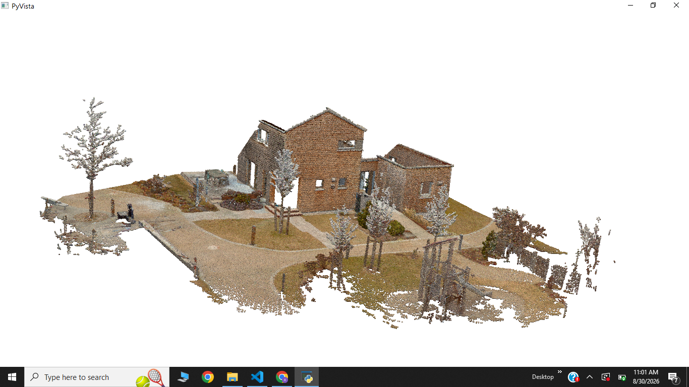
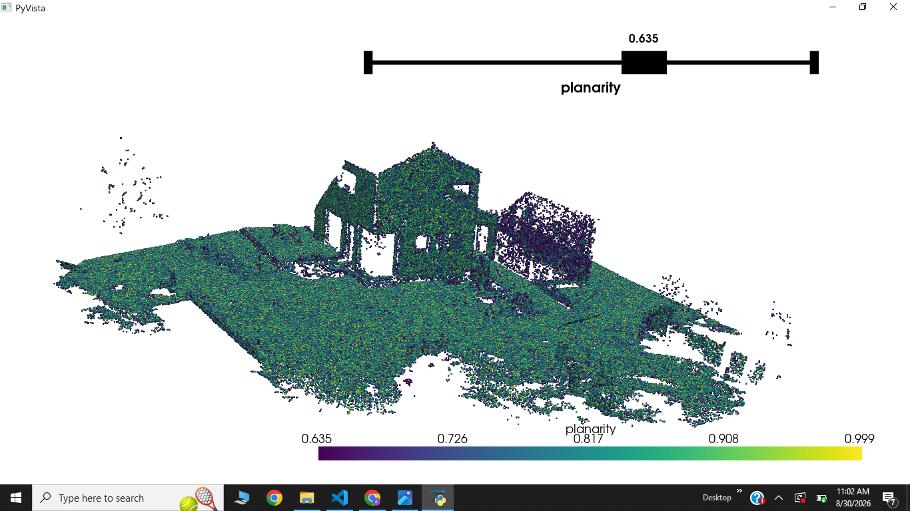
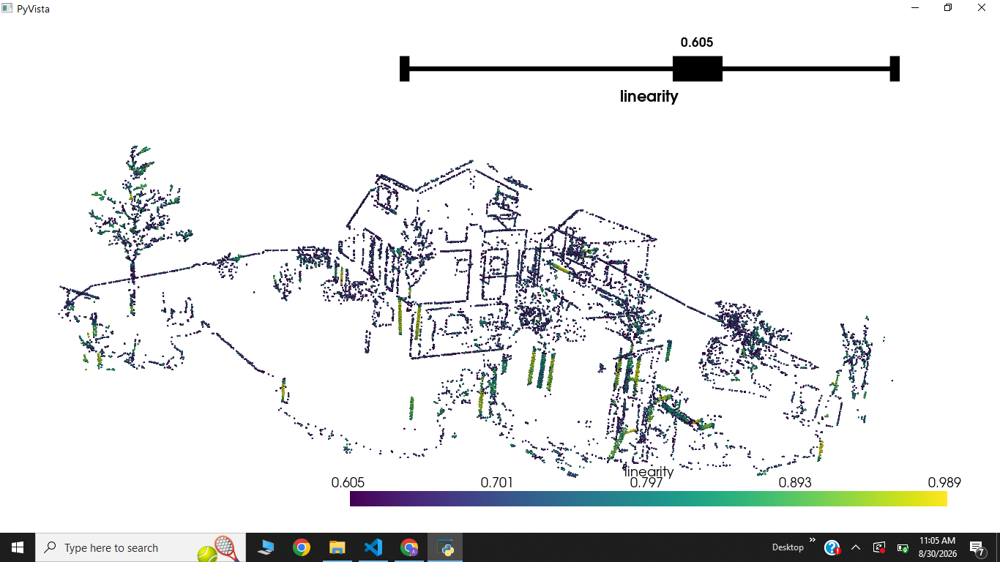
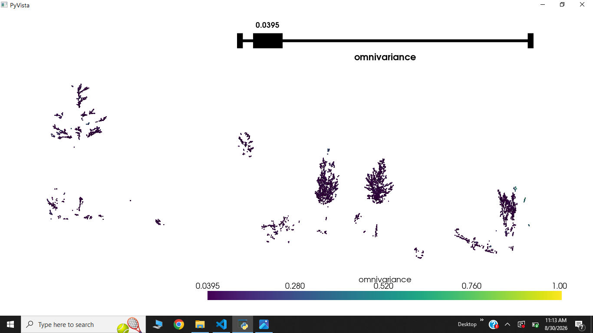
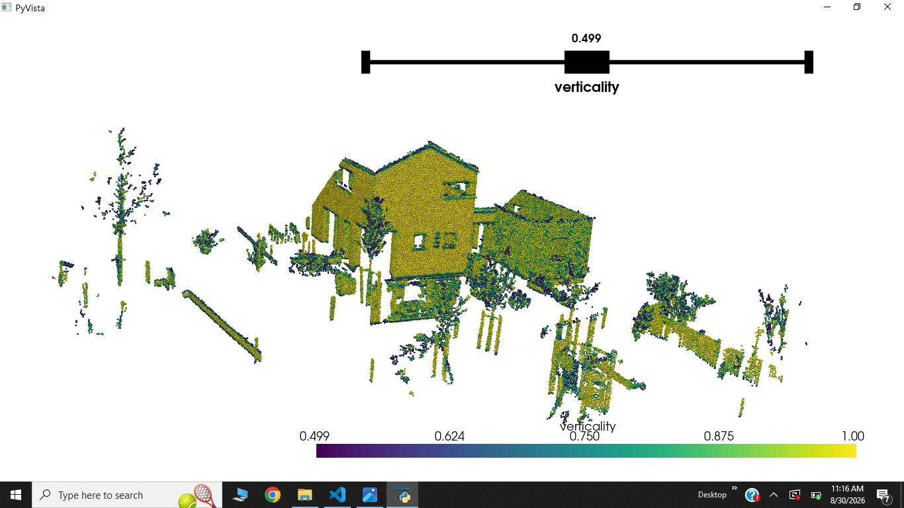
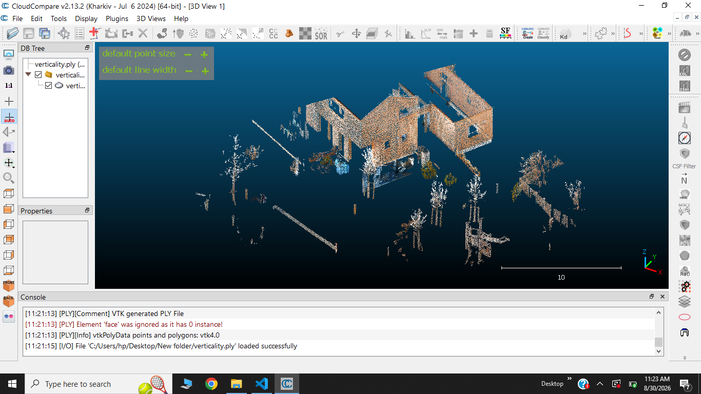

# Interactive 3D Point Cloud Geometric Feature Extraction

Extract local geometric features from a 3D point cloud using **PyVista**, **NumPy**, **SciPy KDTree**, and **PCA**. The project computes **planarity, linearity, omnivariance, and verticality** for each point and provides interactive feature-based segmentation.

---

## Preview

### Original Point Cloud

<p align="center">

</p>

### Geometric Features

| Planarity | Linearity |
|:---:|:---:|
|  |  |

| Omnivariance | Verticality |
|:---:|:---:|
|  |  |

### Segmentation Output (Verticality) - Exported and Visualized in CloudCompare

<p align="center">



</p>

---

## Features

- Load and clean 3D point clouds
- K-nearest neighbour search using KD-Tree
- Local PCA computation
- Surface normal estimation
- Planarity calculation
- Linearity calculation
- Omnivariance calculation
- Verticality calculation
- Interactive feature thresholding
- Export segmented point cloud

---

## Project Structure

```text
interactive-point-cloud-feature-extraction/
│
├── data/
│   └── point_cloud.ply
│
├── outputs/
│   └── README.md
│
├── assets/
│   ├── original_point_cloud.png
│   ├── planarity.png
│   ├── linearity.png
│   ├── omnivariance.png
│   ├── verticality.png
│   └── segmentation.png
│
├── src/
│   └── main.py
│
├── config.yaml
├── requirements.txt
├── README.md
├── LICENSE
└── .gitignore
```

---

## Workflow

```text
Load Point Cloud
        │
        ▼
Clean Point Cloud
        │
        ▼
Build KD-Tree
        │
        ▼
K-Nearest Neighbours
        │
        ▼
Local PCA
        │
        ▼
Eigenvalues + Eigenvectors
        │
        ▼
Geometric Feature Extraction
        │
        ▼
Feature Normalization
        │
        ▼
Interactive Thresholding
        │
        ▼
Point Cloud Segmentation
        │
        ▼
Export Segmented Point Cloud
```

---

## Requirements

- Python 3.10+
- PyVista
- NumPy
- SciPy
- PyYAML

Install dependencies:

```bash
pip install -r requirements.txt
```

---

## Configuration

All processing parameters are stored in **config.yaml**.

Example:

```yaml
input_path: ".../data/point_cloud.ply"

merge_tolerance: 0.001

knn: 20

segmentation_feature: "verticality"

point_size: 3

output_path: "../outputs/segmented_point_cloud.ply"
```

| Parameter | Description |
|-----------|-------------|
| `input_path` | Input point cloud |
| `merge_tolerance` | Point cleaning tolerance |
| `knn` | Number of neighbours used for PCA |
| `segmentation_feature` | Feature used for segmentation |
| `point_size` | Visualization point size |
| `output_path` | Segmented point cloud output |

---

## Usage

Run the project:

```bash
python src/main.py
```

The program loads and cleans the point cloud, computes local geometric features using the configured number of nearest neighbours, and opens an interactive threshold slider for segmentation.

---

## Geometric Features

### Planarity

Measures how strongly the local neighbourhood resembles a planar surface.

```text
Planarity = (λ₂ - λ₃) / λ₁
```

### Linearity

Measures how strongly the points are distributed along one dominant direction.

```text
Linearity = (λ₁ - λ₂) / λ₁
```

### Omnivariance

Measures the overall 3D variation within the neighbourhood.

```text
Omnivariance = (λ₁ × λ₂ × λ₃)^(1/3)
```

The omnivariance values are normalized between **0 and 1** before segmentation.

### Verticality

Calculated from the Z component of the estimated surface normal.

```text
Verticality = 1 - |nz|
```

---

## Feature Output

| Feature | Description |
|---------|-------------|
| `planarity` | Planar characteristics |
| `linearity` | Linear characteristics |
| `omnivariance` | 3D geometric variation |
| `verticality` | Surface orientation |
| `nx` | Normal X component |
| `ny` | Normal Y component |
| `nz` | Normal Z component |

---

## Interactive Segmentation

The feature specified in `config.yaml` is used for segmentation.

For example:

```yaml
segmentation_feature: "verticality"
```

The slider dynamically changes the threshold and extracts points satisfying the selected value.

---

## Output

The segmented point cloud is saved to the location specified by `output_path`.

Example:

```text
outputs/segmented_point_cloud.ply
```

---

## Future Improvements

- Radius-based neighbourhood search
- Multi-scale feature extraction
- Additional geometric features
- Faster PCA computation
- Automatic feature-based classification
- Machine-learning-based point cloud segmentation

---

## License

This project is licensed under the MIT License.

---

## References

- Poux, F. *3D Data Science with Python*. O'Reilly Media, Chapter 7. Used as a reference for the PCA-based point-cloud geometric feature extraction concepts and workflow.
- Point cloud scan provided by Florent Poux and used as the dataset for this project.

---

## Author

**Faisal Ajao**

Passionate about 3D Computer Vision, point cloud processing, and machine learning. Interested in building intelligent systems through spatial AI, 3D data intelligence, and 3D deep learning.
